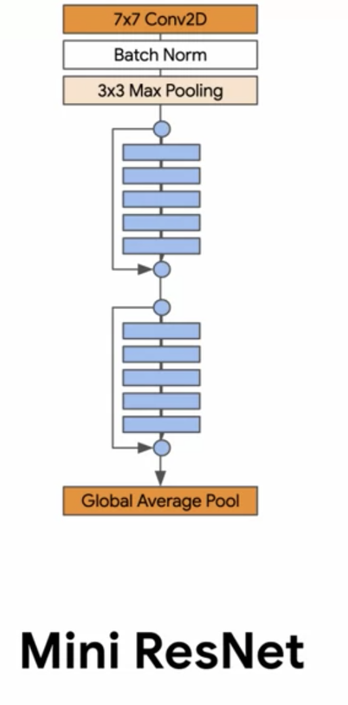
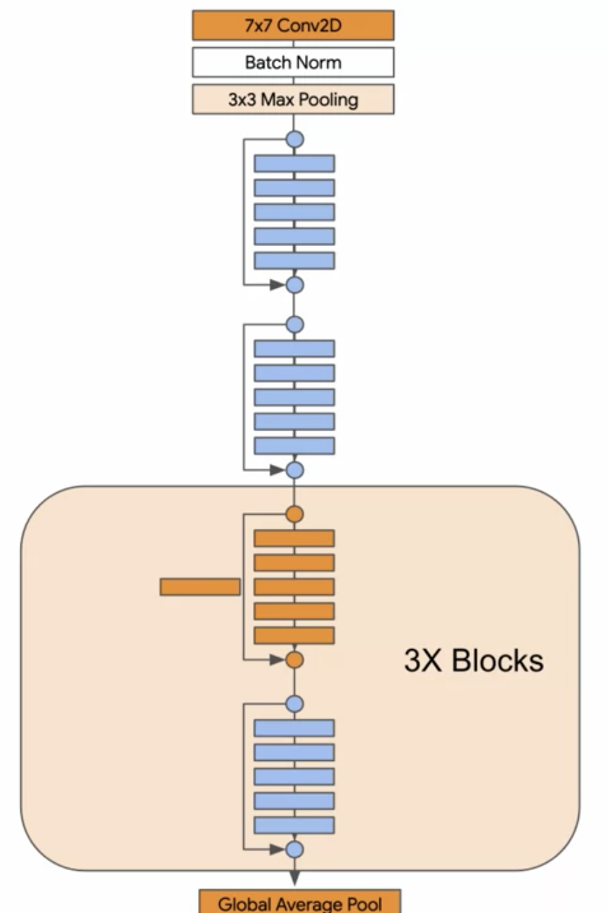
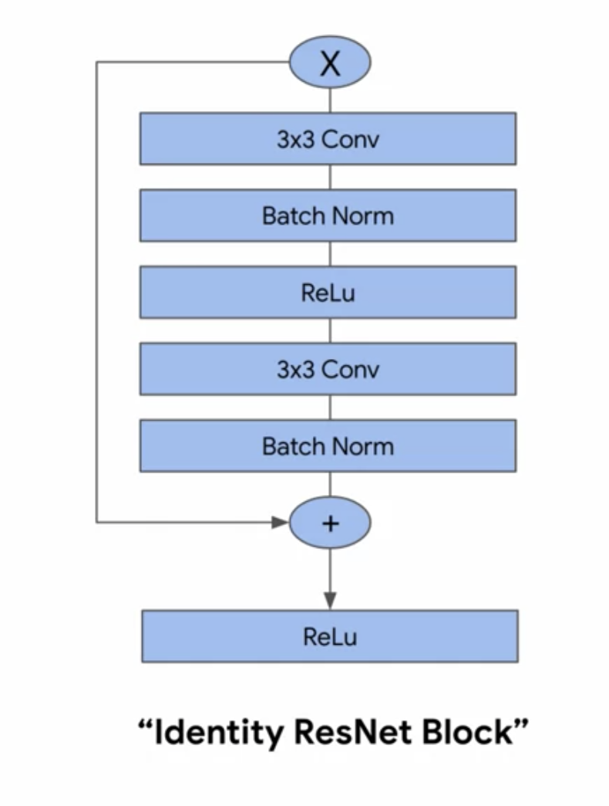
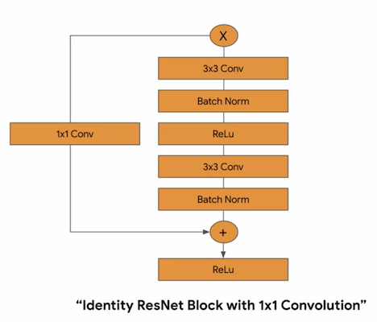

# ResNet

Implementation of the **ResNet** architecture. For this implementation, there are two variants, a
__mini__ version, shown here:

    

as well as a deep version, __resnet34__, shown here:

    

Where the blue and orange blocks are defined as follows:

    

    

## Training

Simply running `python train-mini.py` or `python train-resnet34.py` should start the download of the
dataset and being training. _This will take a while depending on the hardware_
