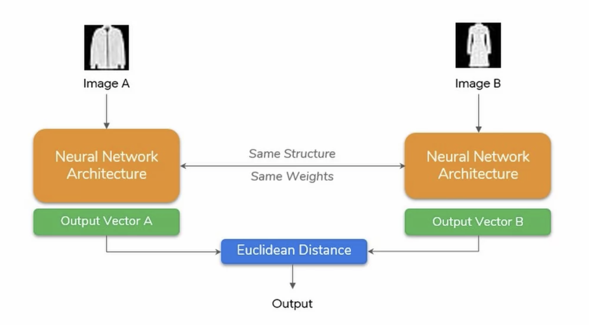

# Siamese Neural Network

Implementation of the **Siamese** architecture shown below:

    

## Training

Simply running `python train-mini.py` or `python train-resnet34.py` should start the download of the
dataset and being training. _This will take a while depending on the hardware_
