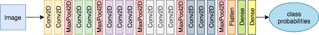

# VGG16

Implementation of the **VGG16** architecture outlined below.

<p>
    
</p>

VGG16 consists of several blocks of 2D convolutions followed by a max pooling. The convolutions are
repeated twice in the first phase of the model, and then three times in the latter stages.

This is defined depending on the `repetitions` parameter in `model.layers.VGGBlock`:

```python
...
# Define a conv2D_0, conv2D_1, etc based on the number of repetitions
for i in range(repetitions):

    # Define a Conv2D layer, specifying filters, kernel_size, activation and padding.
    vars(self)[f'conv2D_{i}'] = tf.keras.layers.Conv2D(
        filters=self.filters,
        kernel_size=self.kernel_size,
        activation='relu',
        padding='same')
...
```

## Training

Simply running `python train.py` should start the download of the dataset and being training. _This
will take a while depending on the hardware_
